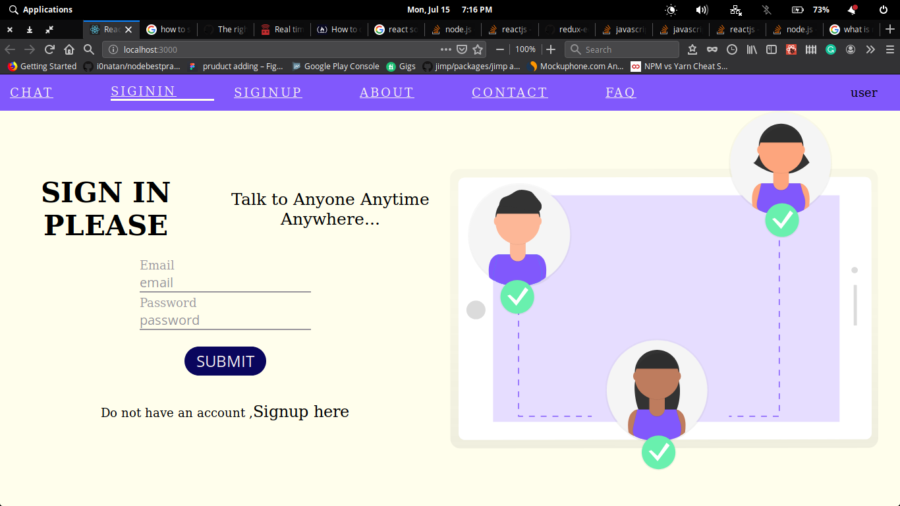
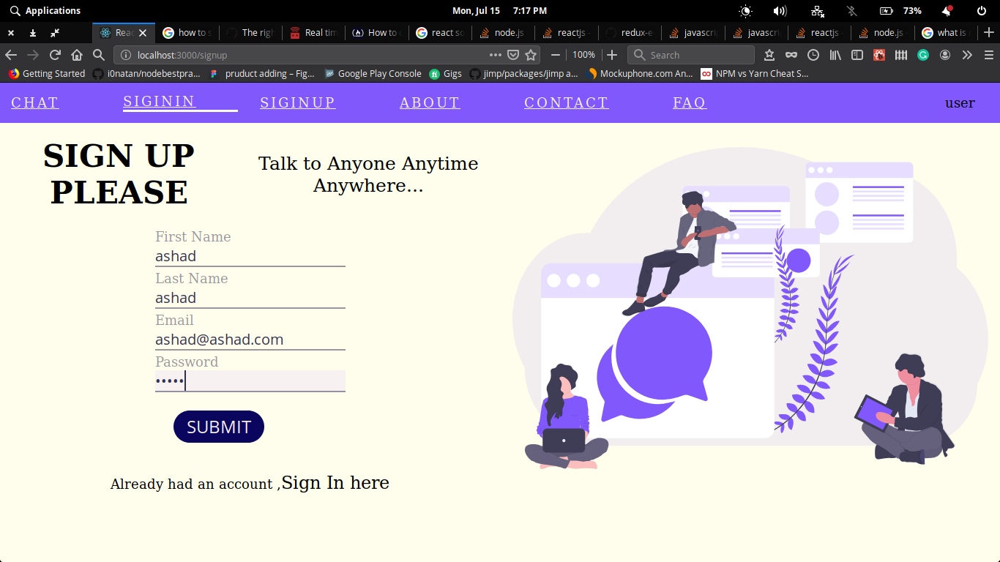
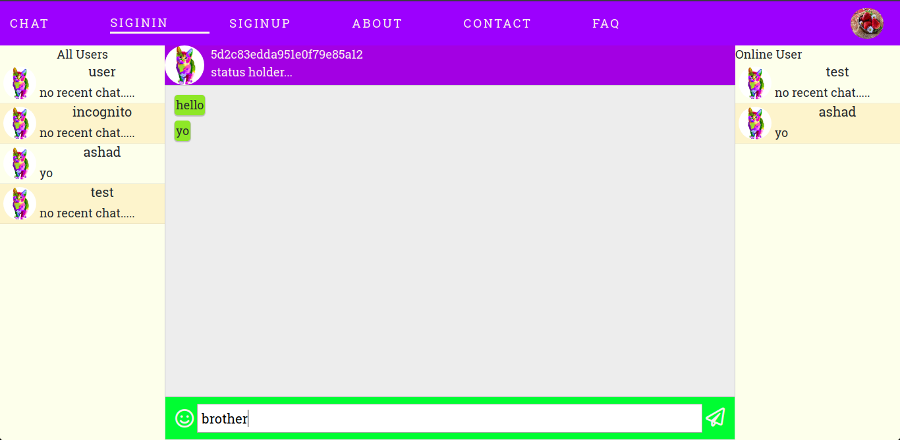
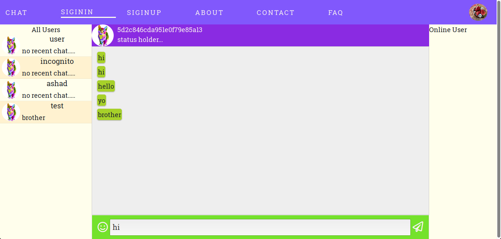

# React chat app using socket.io

React chat is built with the frontend technoligy linke reactjs
and backen technology like nodejs,express,mongoDB and Socket.io

**sign in image of**

**Signup Image**

**Chat image**

**Chat image**

## How to start

**FRONTEND**

- navigate to frontend
- run `npm start` or `yarn start`

**BACKEND**

- start your mongodb server if not
- run `cd backend`
- run `node server`

## This Web app is not complete 

Thier may be some bug which need to be addressed ,
One of them is that chat doesn't update in UI while the chat is logged on console

**I will address all of them when I will got time.**
