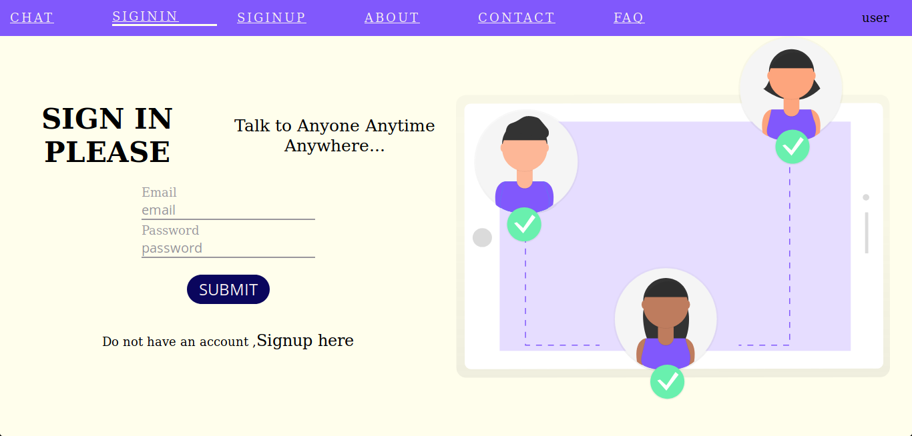
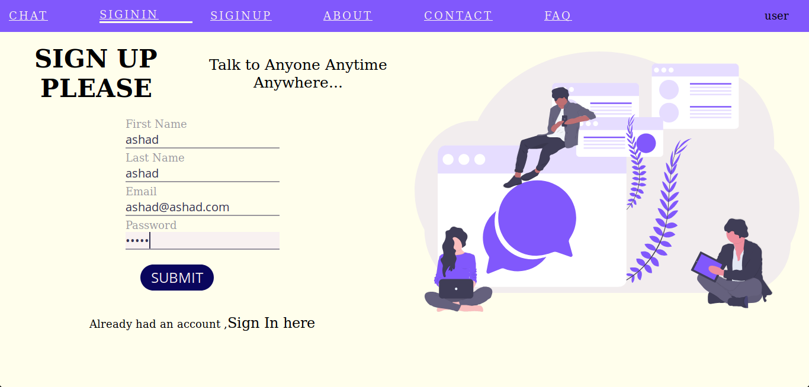

# React chat app using socket.io

React chat is built with the frontend technoligy linke reactjs
and backen technology like nodejs,express,mongoDB and Socket.io

** sign in image of **

** Signup Image **

** Chat image **

** Chat image **

